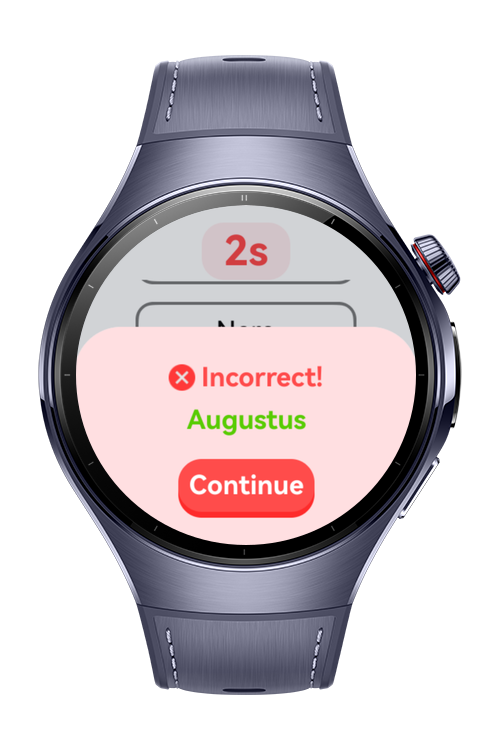
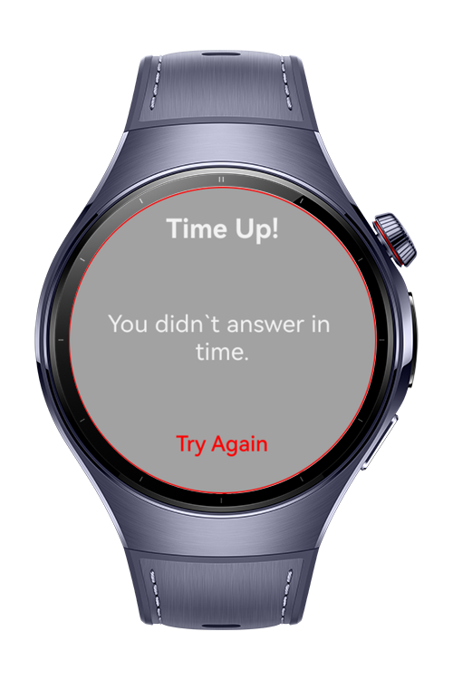
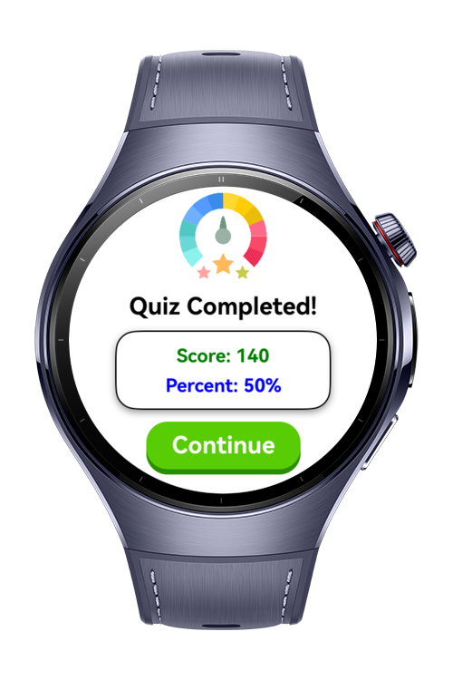

> **Note:** To access all shared projects, get information about environment setup, and view other guides, please visit [Explore-In-HMOS-Wearable Index](https://github.com/Explore-In-HMOS-Wearable/hmos-index).

# QuizMaster (Trivia Game)

The app allows users to play a trivia quiz by spinning a category wheel and answering timed questions. Players receive immediate audio feedback for correct and incorrect answers, and a final score is shown at the end of each round.

# Preview

<div>
  
  
  
  
</div>

# Use Cases

- Spin a category wheel to get a random quiz topic
- Answer trivia questions under a 10-second timer
- Get instant audio feedback for right and wrong answers
- View the final score at the end of the quiz
- Receive alerts when time runs out and retry

# Tech Stack

- **Languages**: ArkTS, ArkUI
- **Frameworks**: HarmonyOS SDK 5.0.2(14)
- **Tools**: DevEco Studio Version 5.1.0.828
- **Libraries**:
    - `@kit.ArkUI`
    - `@kit.AbilityKit`
    - `@kit.BasicServicesKit`
    - `@kit.PerformanceAnalysisKit`
    - `@kit.MediaKit`
    - `@kit.AudioKit`

# Directory Structure

```
entry/
├── src/main/ets/
│ ├── components/
│ │ ├── CustomButton.ets
│ │ └── TextQuestion.ets
│ │
│ ├── entryability/
│ │ └── EntryAbility.ets
│ │
│ ├── entrybackupability/
│ │ └── EntryBackupAbility.ets
│ │
│ ├── model/
│ │ ├── Question.ets
│ │ ├── QuizStatus.ets
│ │ └── Score.ets
│ │
│ ├── pages/
│ │ ├── Index.ets
│ │ ├── QuizScreen.ets
│ │ ├── ScoreScreen.ets
│ │ └── SpinTheWheelsScreen.ets
│ │
│ ├── utils/
│ │ └── QuizData.ets
│ │
│ └── viewmodel/
│ └── Questions.ets
```

# Constraints and Restrictions
## Supported Device

* Huawei Watch 5

# License

**QuizMaster** is distributed under the terms of the MIT License

See the [LICENSE](./LICENSE) for more information.
